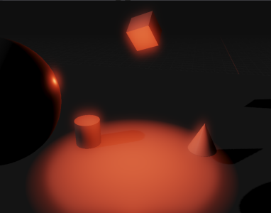
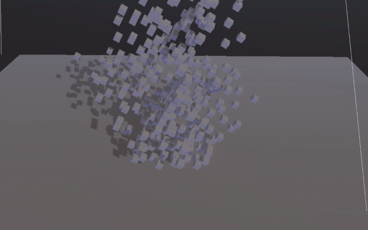

# Electro

*High Performance 3D Game Engine, with a high emphasis on Rendering*

 
 

# MainFeatures

### Rendering

- PBR Renderer (Cook–Torrance GGX)
- IBL (Image Based Lightning)
- Cascaded Shadow maps
- Dynamic Materials
- Post Processing Effects

### Physics

- Integrated 3D Physics Engine, powered by NVIDIA PhysX
- Rigidbody dynamics: static, dynamic and kinematic bodies
- 4 types of collider  
- Collision detection with triggers and callbacks
- Raycasting Support and many more
- Physics Materials

## Scripting

- Full featured C# Scripting, robust C# scripting API. You can learn more about it [here](Resources/Docs/CSharpScriptSystem.md)!

## Other

- Full featured Entity Component System(ECS) support
- Event system
- Logging, image & cubemap loading via editor, YAML reading, UUID, random generators and many more!
- Editor with docking support
- File dialogs, material & component editors
- Asset Management
- Integrated Editor console
- One-click scene loading/saving, YAML serializer(and deserializer) for all components and resources
- Robust project system

# Building

So you want to setup Electro on your system? Awesome! Elaborate guide on setting up Electro is right [here](Resources/Docs/Setup.md)!